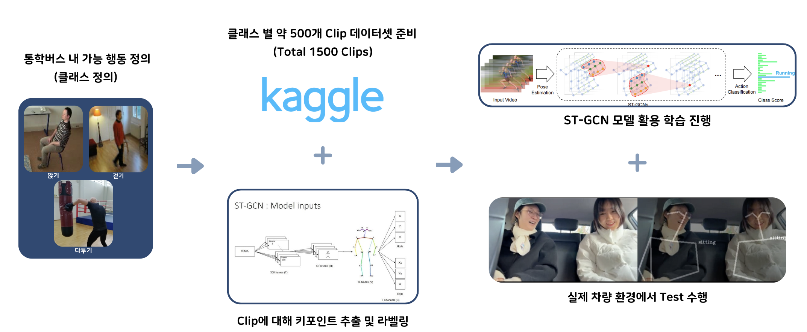
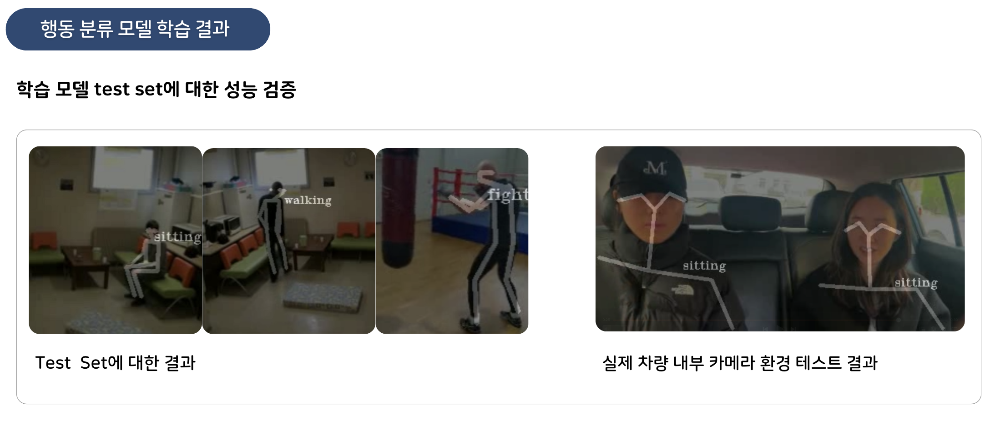

# 후방좌석 행동 감지 기능

## Introduction
후방좌석 행동 감지 기능의 주요 소스코드 작업 및 테스트를 수행한 레포지토리
### 개발 Flow
<div align="center">
    
</div>

## Prerequisites
- Python3 (>3.5)
- [PyTorch](http://pytorch.org/)
- [Openpose](https://github.com/CMU-Perceptual-Computing-Lab/openpose) **with** [Python API](https://github.com/CMU-Perceptual-Computing-Lab/openpose/blob/master/doc/installation.md#python-api).
- 기타 라이브러리 설치 : `pip install -r requirements.txt`

### Installation
``` shell
git clone https://github.com/moon9H/kidSafeMobility.git; cd st-gcn
cd torchlight; python setup.py install; cd ..
```

## How To Use
```shell
python main.py demo_offline [--video ${PATH_TO_VIDEO}] [--openpose ${PATH_TO_OPENPOSE}]
```

## Testing actionRecognition Model
Custom Set으로 학습한 ST-GCN 모델의 성능 평가 방법
```
python main.py recognition -c config/st_gcn/custom_set/test.yaml
```

###result
Top-1 accuracy 기준 평가
<div align="center">
    
</div>
Confusion Matrix
<div align="center">
    
</div>


## Test
단위 테스트 및 실제 환경 테스트 결과
<div align="center">
    
</div>